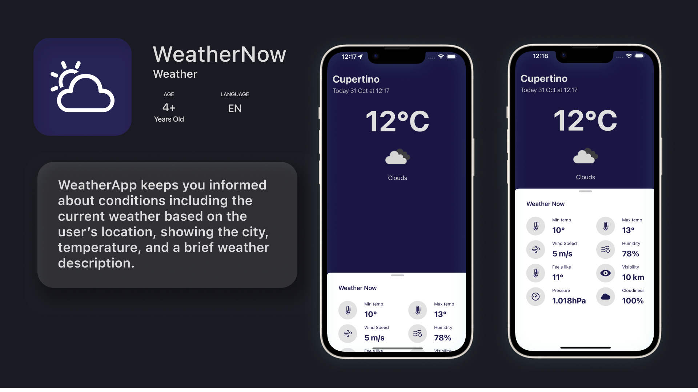

# WeatherApp



## Overview
**WeatherApp** is an iOS application that displays the current weather based on the user’s location, showing the city, temperature, and a brief weather description.

## Features

**Main Screen:**
- Displays the current weather based on the user’s location, including:
  - City name
  - Temperature
  - Weather condition description (e.g., sunny, cloudy, etc.)

**Location & Error Handling:**
- Handles scenarios when the user denies location access, providing a fallback experience.
- Displays appropriate messages for API errors to maintain a smooth user experience.

## Technologies Used

- **Swift**:: The primary programming language used for iOS development.
- **SwiftUI**: Primary framework for building the user interface.
- **MVVM**: Separates the app's business logic from the UI, enhancing code organization and maintainability.
- **CoreLocation**: Handles location-based functionality to retrieve the user’s current coordinates.
- **OpenWeather API**: Fetches real-time weather data based on the user's location.
- **GCD (Grand Central Dispatch)**: Manages asynchronous network requests to enhance performance and responsiveness.
- **SOLID Principles**: The project is structured into layers to ensure clean, modular code that adheres to SOLID design principles.

## Installation

To run the project locally, follow these steps:

1. Clone the repository from GitHub:
   ```bash
   git clone https://github.com/irinadeeva/WeatherNow.git
2. Open the project in Xcode:
   ```bash
   open WeatheNow.xcodeproj
   
